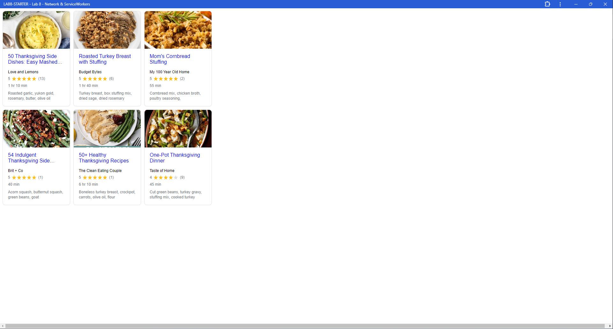

# Lab8-Starter

### Lab Partners:
- Ryan Seidl

### Deployed GitHub Pages URL:
- [https://rseidl25.github.io/lab8-starter/](https://rseidl25.github.io/lab8-starter/)

### Graceful Degradation vs. Service Workers
The purpose of graceful degradation is to allow an application to maintain basic functionality at the very least in the case that some components of said application are failing or inaccessible. In this way, the user of this application should still be able to use the application for its intended purpose no matter any circumstances that hinder its full abilities. On the other hand, service workers are workers that constantly listen in the background for user requests on any given application, storing that request and its corresponding response. The purpose of doing so is to be able to handle user requests to an application's server in the absence of internet connection. Therefore, service workers allow for offline applications to function properly. Given these two definitions, we can see that graceful degradation is different from service workers because it deals solely with an application's ability to remain usable no matter the status of that application's components, whereas service workers are related more to maintaining the usability of an application no matter the status of that application's network connection.

### pwa.png:
